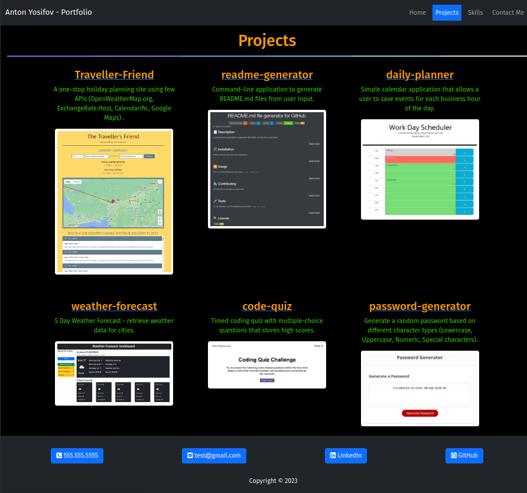

<a id="readme-top"></a>
<div align="center">
<h1 align="center">React Portfolio</h1>
<a href="https://github.com/apyosi/react-portfolio/graphs/contributors"></a>
<a href="https://github.com/apyosi/react-portfolio/network/members"></a>
<a href="https://github.com/apyosi/react-portfolio/stargazers"></a>
<a href="https://github.com/apyosi/react-portfolio/issues"></a>
<a href="https://opensource.org/licenses/MIT"></a>
</div>
<details open>
  <summary>Table of Contents</summary>
  <ol>
    <li><a href="#description">Description</a></li>
    <li><a href="#installation">Installation</a></li>
    <li><a href="#usage">Usage</a></li>
    <li><a href="#contributing">Contributing</a></li>
    <li><a href="#tests">Tests</a></li>
    <li><a href="#license">License</a></li>
    <li><a href="#questions">Questions</a></li>
  </ol>
</details>

<h2 id="description">🧾 Description</h2>

My portfolio recreated with React

<p align="right">(<a href="#readme-top">back to top</a>)</p>

<h2 id="installation">🛠️ Installation</h2>

clone the repo

<p align="right">(<a href="#readme-top">back to top</a>)</p>

<h2 id="usage">▶️ Usage</h2>

[Deployed link of the portfolio website](https://apyosi.github.io/react-portfolio/)

<a href="https://apyosi.github.io/react-portfolio/" target="_blank" rel="noreferrer"></a>


<p align="right">(<a href="#readme-top">back to top</a>)</p>

<h2 id="contributing">🧑🏻‍🔧 Contributing</h2>

Contributions are always welcome!

<p align="right">(<a href="#readme-top">back to top</a>)</p>

<h2 id="tests">🧪 Tests</h2>

To run the test, run the following command: ```npm run test```

<p align="right">(<a href="#readme-top">back to top</a>)</p>

<h2 id="license">🔍 License</h2>

<a href="https://opensource.org/licenses/MIT"></a>

<p align="right">(<a href="#readme-top">back to top</a>)</p>

<h2 id="questions">❓ Questions</h2>

You can reach me for any questions on the email: email@example.com<br>
As well on the github repo page: [https://github.com/apyosi/react-portfolio](https://github.com/apyosi/react-portfolio)

<p align="right">(<a href="#readme-top">back to top</a>)</p>
